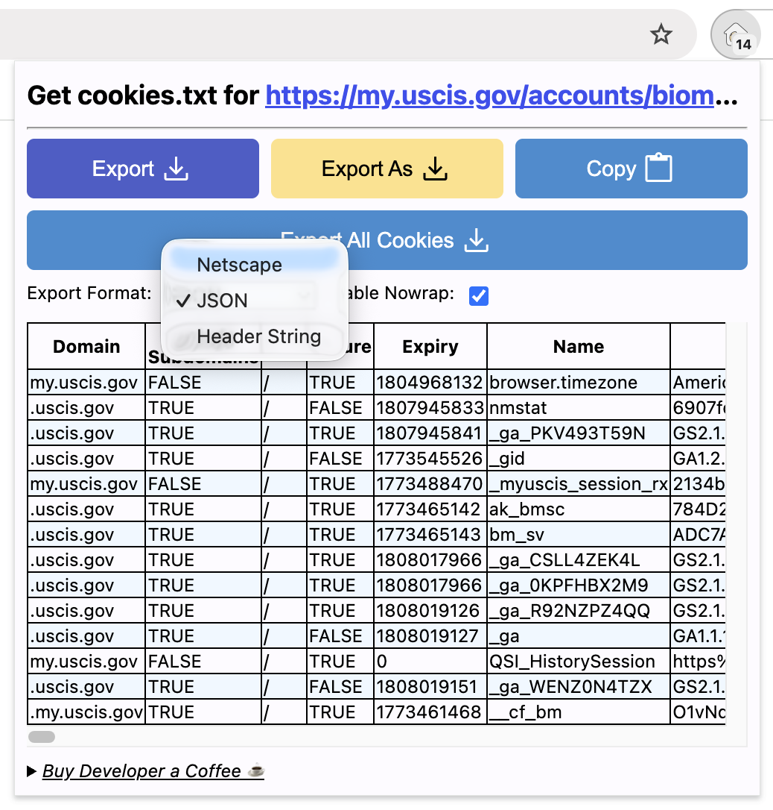

# USCIS Appointment Finder

Find your USCIS biometric appointment ahead of the mailed notice — saving days of postal delay.

## Background

After receiving a Request for Evidence (RFE), you may need to have your biometrics captured at a USCIS Application Support Center (ASC). The initial appointment is scheduled by USCIS and typically arrives by mail or in the online portal several days after the RFE. This script lets you discover your appointment details before the notice arrives, so you can act sooner.

## Prerequisites

- Python 3.10+
- Google Chrome with the [Get cookies.txt LOCALLY](https://chromewebstore.google.com/detail/get-cookiestxt-locally/cclelndahbckbenkjhflpdbgdldlbecc) extension installed

## Installation

Install dependencies:

```bash
pip install requests beautifulsoup4
```

## Usage

### Step 1 — Install the cookie export extension

Install **Get cookies.txt LOCALLY** from the Chrome Web Store.


### Step 2 — Export your cookies

1. Visit https://my.uscis.gov/accounts/biometrics/overview and log in.
2. Open the extension and select **JSON** as the export format.
3. Click **Export** and save the file in this project folder as `my.uscis.gov_cookies.json`.



### Step 3 — Configure the script

Open `main.py` and edit the configuration section near the top:

```python
RECEIPT_NUMBER = "IOE1234567890"   # your receipt number
DATE_OF_BIRTH  = "2000-01-01"     # your date of birth
ALIEN_NUMBER   = ""                # optional

SCAN_START = "2026-03-13"          # start of date range to search
SCAN_END   = "2026-06-30"          # end of date range to search
```

Trim `ASC_CODES` to only include locations near your mailing address — 3 or so is sufficient and dramatically reduces search time.

### Step 4 — Run the script

```bash
python main.py
```

Use `--dry-run` to fire a single test request and verify your cookies are working:

```bash
python main.py --dry-run
```

## How it works

The script iterates over every combination of date, time slot, and ASC location within your configured range, querying the USCIS appointment API for each. Results are grouped by response body, so when your appointment exists you will see a distinct response containing your details.

Progress is saved to `uscis_appointment_results.json` after every request, so the script can resume where it left off if interrupted. If your session expires (CAPTCHA or 403), re-export your cookies and run again — already-completed queries are skipped automatically.

> **Tip:** If your appointment hasn't actually been created yet, delete `uscis_appointment_results.json` daily so stale "not found" results don't mask a newly created appointment.

## Reading the results

When the search finds your appointment, you will see a response like:

```json
{
  "data": {
    "searchResults": [
      {
        "assignedServiceCenter": {
          "code": "...",
          "description": "...",
          "address": "..."
        },
        "appointmentDateTime": "..."
      }
    ]
  }
}
```

This contains your appointment location, date, and time.
