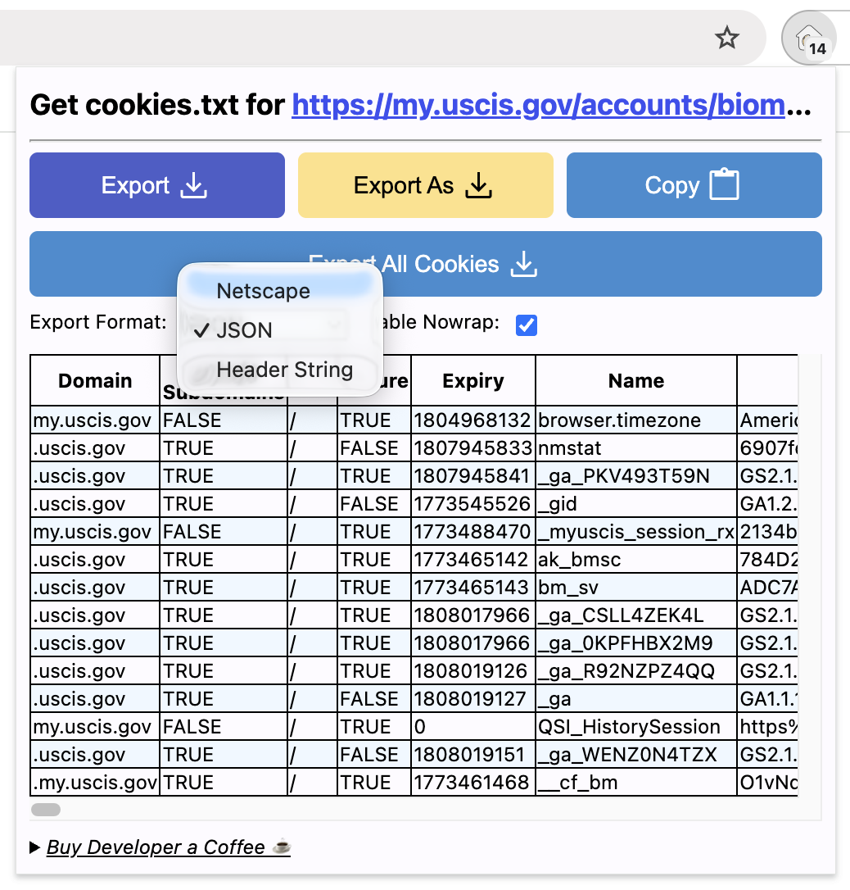

# USCIS Appointment Finder

Find your USCIS biometric appointment ahead of the mailed notice — saving days of postal delay.

## Background

After receiving a Request for Evidence (RFE), you may need to have your biometrics captured at a USCIS Application Support Center (ASC). The initial appointment is scheduled by USCIS and typically arrives by mail or in the online portal several days after the RFE. This script lets you discover your appointment details before the notice arrives, so you can act sooner.

## Prerequisites

- Python 3.10+
- Google Chrome with the [Get cookies.txt LOCALLY](https://chromewebstore.google.com/detail/get-cookiestxt-locally/cclelndahbckbenkjhflpdbgdldlbecc) extension installed

## Installation

Install dependencies:

```bash
pip install requests beautifulsoup4
```

## Usage

### Step 1 — Install the cookie export extension

Install **Get cookies.txt LOCALLY** from the Chrome Web Store.


### Step 2 — Export your cookies

1. Visit https://my.uscis.gov/accounts/biometrics/overview and log in.
2. Open the extension and select **JSON** as the export format.
3. Click **Export** and save the file in this project folder as `my.uscis.gov_cookies.json`.



### Step 3 — Configure the script

Open `main.py` and edit the configuration section near the top:

```python
RECEIPT_NUMBER = "IOE1234567890"   # your receipt number
DATE_OF_BIRTH  = "2000-01-01"     # your date of birth
ALIEN_NUMBER   = ""                # optional

SCAN_START = "2026-03-13"          # start of date range to search
SCAN_END   = "2026-06-30"          # end of date range to search
```

`SCAN_START`, `SCAN_END`, and `ASC_CODES` only affect the optional `--scan` fallback. The
default lookup ignores them, so you do not need to configure them.

### Step 4 — Run the script

```bash
python main.py
```

That's it — one request, and your appointment prints immediately:

```
    When     : Thursday, June 11, 2026 at 10:00 AM
    Where    : USCIS EXAMPLE CITY (XYZ)
    Address  : 123 Example Street Suite 100
               Example City, ST 00000
    Status   : SCHEDULED
```

Use `--dry-run` to fire a single test request and verify your cookies are working:

```bash
python main.py --dry-run
```

## How it works

The `find-appointment` endpoint does an **exact match** on whatever appointment fields you
send it. Pass a date, time, or ASC code that doesn't match your real appointment and
`searchResults` comes back empty — which is why searching for it meant guessing the precise
date + time + location triple.

Omit those three fields entirely and the server has nothing to filter on, so it returns
your appointment directly. Authentication is by session cookie, so the endpoint already
knows which account is asking. One request replaces what was previously a scan of every
combination in the range (152,190 requests at the default settings).

## The `--scan` fallback

The original brute-force scan is still available and now runs in parallel:

```bash
python main.py --scan
```

Measured at ~57 requests/second with `MAX_WORKERS = 16`, versus ~2/second sequentially.
Progress is saved to `uscis_appointment_results.json` and interrupted runs resume
automatically, skipping already-completed queries.

You should not normally need this — it exists in case USCIS changes the endpoint so that
omitting the fields stops working.

### Rate limits

There is no published rate limit, and 40 concurrent requests completed in ~1.0s with zero
throttling during testing. The site does sit behind Akamai Bot Manager (`ak_bmsc`, `bm_sv`)
and Cloudflare (`__cf_bm`), which act on burst *patterns* rather than a fixed threshold, so
`MAX_WORKERS = 16` is deliberately conservative. If you start seeing 403s, lower
`MAX_WORKERS` or raise `DELAY_BETWEEN_REQUESTS`.

> **Tip:** If your appointment hasn't been created yet, the lookup reports "No appointment
> found yet" — just run it again later. Unlike the old scan, there are no stale cached
> "not found" results to clear.

## Reading the results

When the search finds your appointment, you will see a response like:

```json
{
  "data": {
    "searchResults": [
      {
        "assignedServiceCenter": {
          "code": "...",
          "description": "...",
          "address": "..."
        },
        "appointmentDateTime": "..."
      }
    ]
  }
}
```

This contains your appointment location, date, and time.
